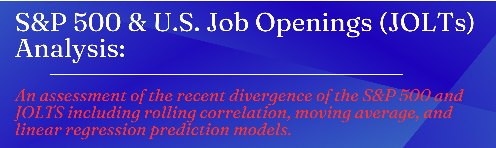
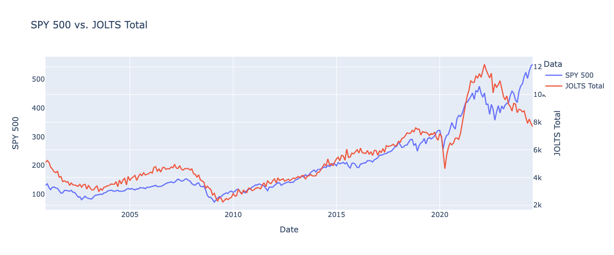
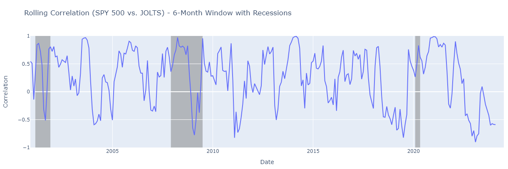
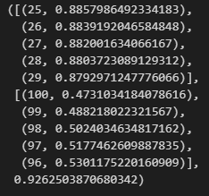
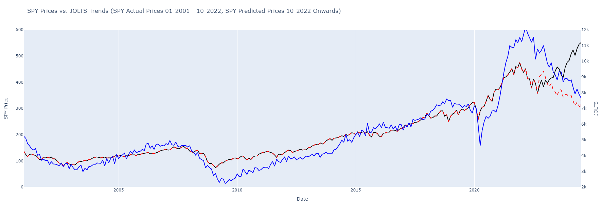
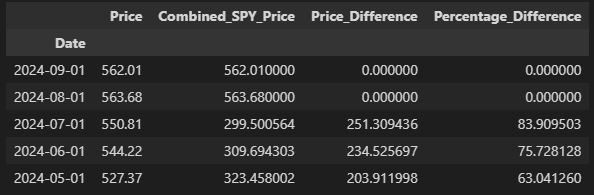
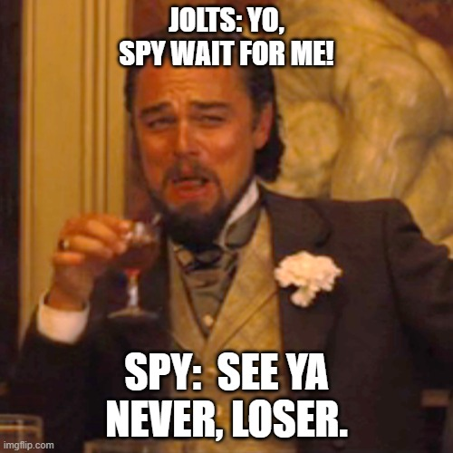

## Did the S&P 500 break up with the U.S. Job Openings after a long-term strong relationship? 
### Overview:
This analysis aims to investigate the relationship between S&P 500 (SPY) and the U.S. Job openings. 

### Data Source:
- Analysis was conducted on Sept 2024, but files are as of July 2024. 
- SPY Data: Historical daily S&P 500 ETF (SPY) prices from 2000 to 2024.
- JOLTS Data: Monthly data on job openings across various sectors in the U.S. economy, from the U.S. Bureau of Labor Statistics (BLS).

### Analysis Summary:
#### 1. Data Preprocessing: 
- Basic Preprocessing was conducted on both datasets to confirm matching dates and formats. 
- The datasets were merged using the date column.

#### 2. Correlation Analysis:
**Correlation Hypothesis:** I initially hypothesized that there would be a strong correlation between SPY prices and JOLTS (Job Openings). Generally, strong job opening data reflects a robust economy, as companies expand and create more positions, which in turn should benefit businesses and drive stock prices higher. 

**Historical Trends:** Between 2001 and mid-2009, JOLTS consistently trended higher than SPY prices, similar to the periods from 2015 to 2019 and April 2021 to March 2023.
##### SPY 500 VS. JOLTS Totals with Recessions pds. 

**Recent Divergence:** 
- From September 2022, an interesting divergence occurs where SPY prices begin to rise while job openings (JOLTS) continue to decline. This suggests that while the labor market appears to be softening, the stock market has started to recover. 
- What could explain this disconnect? What changed in the labor market or investors' minds that caused the divergence? 

**Fluctuating Correlation:** The correlation between SPY and JOLTS is not consistently positive or negative. It swings back and forth, which suggests that the relationship between stock prices and job openings is dynamic. 

**Correlation Around Recessions:** During recessions (shaded areas), the correlation tends to drop or become more volatile. 

**Around 2020, during the COVID-19-induced recession,** there is a significant drop in correlation. The sudden drop could reflect the drastic economic impacts of the pandemic, where the job market and stock prices reacted differently. As I recall, there was a large number of job openings and a lack of talent to fill the roles.

#### **3. Moving Average Correlation:**
- This analysis aimed to find the moving average with the strongest positive relationship to SPY Prices. The 25-day MA appeared to have the strongest relationship. 

#### **4. Predictive Modeling:**
- A linear regression model was developed to predict SPY prices using JOLTS data as the independent variable.
- The model was trained on historical data up to a certain cutoff date and then used to forecast SPY prices beyond this date. The model focuses on historical data, using SPY and JOLTS data only up to September 30, 2022, for model training. 
- I selected Sept 2022 as the cut-off date to train the model because that is when the divergence between JOLTs and SPY Prices starts.
  

**Therefore, I wanted to understand what would have been the prices of the SPY 500 if the divergence did not occur.**
- When looking at the Percentage difference on July 1, 2024, between Actual SPY Prices (550.81) and the Predicted Price (299.5), there was a 251.3 point difference, or 83.9% difference. 
- When we compare the July 1, 2024 Predicted Price from the original analysis (above) it was 315.1, for this 2nd analysis it is 299.5, and the actual price was 550.8.
  

#### **5. Conclusion:** 
- I conducted this analysis to practice my Python skills and explore the relationship between job openings, which typically indicate a strong economy, and the SPY500, a popular ETF tracking the stock market. 
- I expected that high SPY prices would correlate with strong job openings, and indeed, I found a strong correlation of 0.92. However, I noticed a divergence after October 2022, suggesting a potential shift in economic dynamics. 
- This could indicate that the market is pricing in future expectations differently than before, perhaps due to changes in monetary policy or other economic factors. For example, investors don't want to miss the strong performance of the SPY 500 and expect monetary policy to help JOLTs in the future. 
- It’s also possible that businesses are focusing more on innovations such as AI and margins rather than hiring, which could be why job openings have slowed down.

#### **Sorry more questions/thoughts here:**
**This divergence could suggest several scenarios:**
1. Are organizations reducing job openings in anticipation of economic challenges that the stock market has not yet reflected?
2. Could the stock market be projecting strong economic growth despite lower JOLTS numbers, especially with unemployment rates at historic lows?
3. Do high SPY prices indicate that a strong relationship with JOLTS is no longer necessary? If so, what does this signify about the changing economic landscape? Does the lack of correlation suggest that traditional indicators like JOLTS are becoming less relevant for predicting stock market performance?

.............So many questions brewing

**What could happen next?**
1. I plan to continue to monitor the relationship between JOLTS and SPY as I am interested in seeing what unfolds. 
2. What could potentially be the next move?
    - **Best Case scenario:** Monetary Policy changes and JOLTs increase as SPY Prices increase as well. If this happens, will JOLTS catch up to SPY to mirror the directional relationship of the past? 
    - **OK Case Scenario:** Monetary Policy changes and JOLTs increase as SPY Prices trade in a range until JOLT values catch up as a reversion to the mean? Can this be possible? 
    - **Weird Case Scenario:** JOLT values continue to decrease as SPY Prices continue to increase. 
    - **Worst-case Scenario:** JOLT value stays relatively the same as SPY Prices met it at the predicted values (315 or 299)
    - **POOPY DOOPY Case Scenario:** JOLT values continue to decrease low as SPY prices met the predicted values (315 or 299).
## Although I answered a few of my questions and discovered interesting findings, I am now left with more questions. I will continue to monitor this relationship to understand how it unfolds. 

